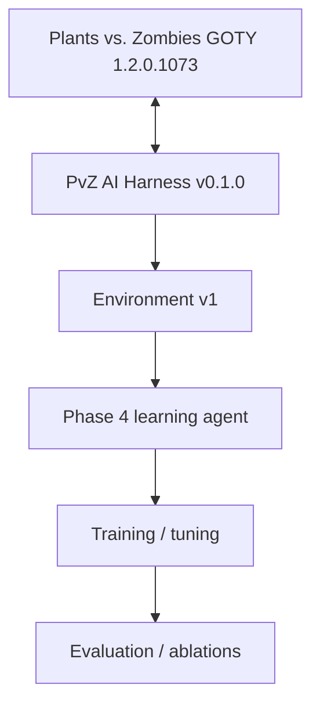

# PvZ Deep Learning

Phase 4+ research repository for training, tuning, and evaluating learning agents on top of the frozen [PvZ AI Harness](https://github.com/b3d012/PvZ-AI-Harness).

> **Current status:** Phase 1–3.5 infrastructure is frozen in `PvZ-AI-Harness` v0.1.0. This repository begins Phase 4 and intentionally contains no trained model or committed RL algorithm yet.

## Why this is a separate repository

The harness is now a reusable project in its own right. Keeping learning code separate means the Windows/process/memory/controller/runtime stack can remain stable while this repository evolves quickly through experiments, model architectures, hyperparameter tuning, checkpoints, and evaluation code.



The Phase 4 repository must consume the harness through its public contracts rather than copying memory offsets, Win32 input code, focus logic, or placement rules.

## Frozen upstream dependency

Initial development is pinned to:

- Harness release: **v0.1.0**
- GameState: **v1**
- Observation: **v1**, shape `(5534,)`
- Action: **v1**, `541` actions
- Controller: **v1**
- Environment: **v1**
- Reward: **v1**
- Transition JSONL schema: **v2**

`src/pvz_deeplearning/harness.py` asserts this contract so an accidental incompatible harness upgrade fails loudly instead of silently invalidating an experiment.

## Setup

Windows 10/11 and Python 3.12 are the current supported development target because live training depends on the Windows-only harness.

```powershell
git clone https://github.com/b3d012/PvZ-DeepLearning.git
cd PvZ-DeepLearning
conda env create -f environment.yml
conda activate pvz-rl
python -m pip install -e .
python scripts/check_harness.py
```

The project dependency installs `PvZ-AI-Harness` directly from the frozen `v0.1.0` Git tag. The game itself is not included; live experiments require the user's own legally obtained compatible PvZ GOTY installation.

## Repository layout

```text
configs/                     Tracked experiment/model configuration
src/pvz_deeplearning/        Phase 4 Python package
  harness.py                 Frozen upstream contract gate
  models/                    Future neural policy/value models
  training/                  Future training pipelines
  evaluation/                Evaluation and ablation code
tests/                       Offline tests; must not interact with the desktop
scripts/                     Developer/research entry points
docs/                        Research plan and Phase 4 technical report
results/README.md             Tracked result summaries only
```

Large generated artifacts are intentionally ignored: checkpoints, datasets, TensorBoard/W&B runs, Optuna databases, trajectories, raw logs, and generated result payloads.

## Phase 4 roadmap

The precise algorithm is intentionally **not locked yet**. A masked PPO-family baseline is a strong candidate, but algorithm selection should follow an explicit design comparison rather than being baked into repository structure.

1. **Phase 4.0 — Research foundation**: pin and verify harness contract, reproducibility rules, CI, artifact policy. ✅
2. **Phase 4.1 — RL interface & experimental protocol**: decide wrapper/API, timing, reset workflow, terminal handling strategy, evaluation protocol, and baseline candidates.
3. **Phase 4.2 — First learned baseline**: implement one reproducible masked deep-RL baseline.
4. **Phase 4.3 — Training infrastructure**: checkpoints, run manifests, recovery, metrics, deterministic seeds, and bounded live training.
5. **Phase 4.4 — Hyperparameter tuning**: algorithm-specific search spaces and reproducible tuning studies.
6. **Phase 4.5 — Evaluation & ablations**: compare learned policy against frozen random/scripted baselines and controlled variants.

Any genuine harness deficiency discovered during Phase 4 should be fixed in `PvZ-AI-Harness`, released there as a new version, and then deliberately upgraded here. Do not patch around harness bugs inside model code.

## Reproducibility contract

Every durable training/evaluation run should eventually record at least:

- algorithm and full hyperparameters;
- random seed(s);
- this repository's Git commit;
- harness release and resolved harness commit;
- Environment/Observation/Action/Reward/Transition schema versions;
- level/episode configuration and active rows;
- model architecture;
- training budget/step timing;
- device/software versions;
- checkpoint identity;
- evaluation results.

This metadata should travel with checkpoints and published result summaries.

## CI and tests

The initial suite is deliberately offline and safe:

```powershell
python -m compileall -q src tests scripts
python -m unittest discover -s tests -p "test_*.py" -v
```

CI installs the pinned harness and checks that its frozen public contract still matches the expectations of this repository. CI must never send live desktop input.

## Relationship to the harness

For the game-integration implementation, documentation, monitor, live validation, and cumulative Phase 1–3.5 engineering report, see **[PvZ-AI-Harness](https://github.com/b3d012/PvZ-AI-Harness)**.

## License

GPL-3.0-only, matching the upstream harness. See `LICENSE`.

Plants vs. Zombies is the property of its respective rights holders. This is an independent educational/research project and is not affiliated with or endorsed by PopCap or EA. No proprietary game files are distributed here.
