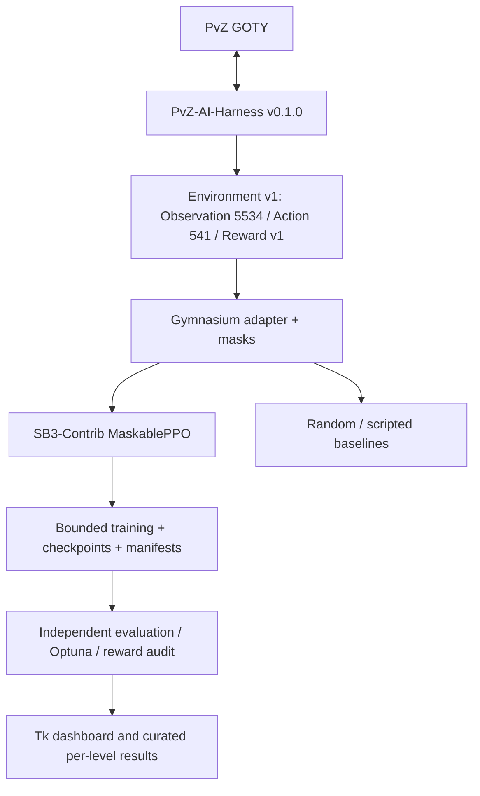

# PvZ Deep Learning

An auditable deep-reinforcement-learning research stack for the real Plants vs. Zombies GOTY 1.2.0.1073 client, built strictly above [PvZ AI Harness v0.1.0](https://github.com/b3d012/PvZ-AI-Harness).

> **Status:** Phase 4 offline implementation is complete and its live factory
> is release-gated. The harness training-lifecycle candidate is pushed but not
> merged or released; real WON/LOST, automatic reset, and managed pickups still
> require live validation. No real training result is claimed.



## Why MaskablePPO

The environment has a large discrete action space whose legal subset changes every step, and interaction with one real game is slow. sb3-contrib provides native masks during both learning and prediction, mature checkpointing, custom policy architectures, CPU/CUDA support, and local metrics. The full comparison and limitations are in [Phase 4.1 design](docs/PHASE_4_1_DESIGN.md).

Available model IDs are `maskable_ppo_mlp_small` (`128,128`), `maskable_ppo_mlp_medium` (`256,256`), and `maskable_ppo_mlp_large` (`512,256,128`). Size is an experimental variable, not a quality ranking. New algorithms implement the backend protocol and register in `algorithms/registry.py`; no environment or result rewrite is needed.

## Setup

```powershell
conda env create -f environment.yml
conda activate pvz-rl
python -m pip install -e .[tuning,tensorboard]
pvz-dl doctor
```

The harness dependency is pinned to immutable tag `v0.1.0`. Local editable harness development is allowed for development only; durable runs record both release and resolved commit.

## Commands

```powershell
pvz-dl doctor
pvz-dl train --config configs/experiments/mock_smoke.yaml
pvz-dl train --config configs/experiments/mock_smoke.yaml --resume artifacts/runs/PARENT/checkpoints/latest.zip
pvz-dl evaluate --policy checkpoint --checkpoint artifacts/runs/RUN/checkpoints/latest.zip --episodes 10
pvz-dl evaluate --policy random-valid --episodes 10
pvz-dl audit-reward artifacts/runs/RUN/transitions/transitions.jsonl
pvz-dl inspect artifacts/runs/RUN
pvz-dl reproduce artifacts/runs/RUN
pvz-dl tune --config configs/experiments/mock_smoke.yaml --trials 3
pvz-dl tune-report --study maskable_ppo_mock --storage artifacts/tuning/study.db
pvz-dl dashboard --run artifacts/runs/RUN
tensorboard --logdir artifacts/runs/RUN/tensorboard
```

`live_pilot.yaml` is deliberately fail-closed even with `--yes` until the upstream blockers are released and validated. No ordinary/offline command sends desktop input.

## Reproducibility and results

Each ignored `artifacts/runs/<run-id>/` contains an immutable manifest, resolved YAML, checkpoints, JSONL metrics, evaluation, TensorBoard, and transitions. Manifests record Git/harness IDs, all schemas, level, architecture, hyperparameters, five software seed roles, uncontrolled game RNG, versions, device, timing, budget, and lineage. A separate immutable `run_completion.json` records final checkpoint path/SHA256, step, completion reason, finish time, and optional evaluation reference. Raw checkpoints never enter Git. Curated real/pilot/mock classifications live in [results/RESULTS.md](results/RESULTS.md); there are currently no real learned-policy results.

The first live candidate is Adventure 1-4 at normal speed and 250 ms decisions. It replaces 1-5 because 1-5 is Wall-nut Bowling rather than the intended Sunflower/Peashooter economy problem. The exact GOTY seed bank and repeatability remain live-validation items. Evaluation separates natural win/loss from horizon and technical truncations and reports distributions, not a best episode. See [research plan](docs/RESEARCH_PLAN.md) and [technical report](docs/technical-report.tex).

## Limitations and roadmap

- A read-only check observed a real paused Adventure level 7 Board and the candidate outcome evidence mapped it to `RUNNING`; no WON/LOST, reset, pickup, model-action, reward, resume, evaluation, or throughput result is claimed.
- Harness v0.1.0 remains the durable pin. Candidate lifecycle APIs are not a release, and no automatic restart driver has passed live validation.
- PvZ RNG is not controlled by recorded software seeds.
- Action v1 has no shovel action; it remains intentionally deferred.
- Structured neural encoders await versioned observation slice metadata; the MLP uses the frozen flat vector without mystery indexes.

Next: complete the ordered live protocol, implement/validate the automatic current-level restart driver, publish the harness release, pin it here, and run a bounded Adventure 1-4 pilot before tuning or multi-seed comparisons.
